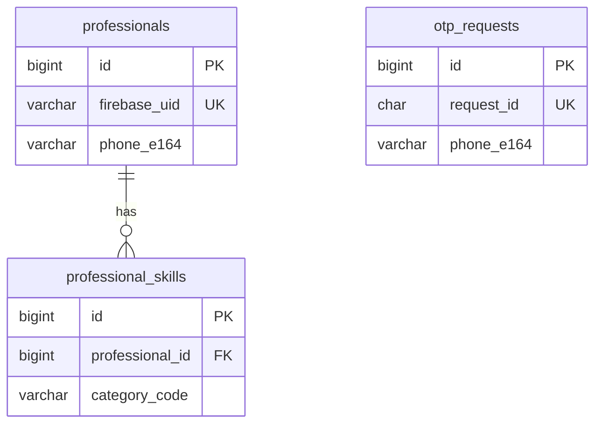

# Pro-Enroll — MySQL table structure

Database: **`pro_enroll`**  
Engine: **InnoDB**  
Charset: **utf8mb4** / **utf8mb4_unicode_ci**  
MySQL version: **8.0+**

Canonical DDL: [`schema.sql`](./schema.sql)

---

## Overview

| Table | Purpose |
|-------|---------|
| `professionals` | Registered service professionals (profile, KYC, availability, payouts) |
| `auth_accounts` | Login identity per phone (links to `professionals`) |
| `auth_sessions` | JWT sessions + refresh tokens (revocable) |
| `auth_login_attempts` | Audit log for OTP / refresh / logout |
| `otp_requests` | Phone OTP challenges for JWT sign-in (sent via PHP `mail()`) |
| `professional_skills` | Categories and experience years per professional |



`otp_requests` is not linked by foreign key to `professionals`; after OTP verify, a row is created or loaded in `professionals` by `phone_e164`.

---

## `professionals`

Core account for each enrolled professional. Authenticated via JWT where `sub` matches `firebase_uid` (legacy column name; value is an app-generated auth id such as `pro_<hex>`).

| Column | Type | Null | Default | Description |
|--------|------|------|---------|-------------|
| `id` | `BIGINT UNSIGNED` | NO | AUTO_INCREMENT | Primary key |
| `firebase_uid` | `VARCHAR(128)` | NO | — | Unique auth subject (JWT `sub`) |
| `phone_e164` | `VARCHAR(20)` | YES | NULL | E.164 phone, e.g. `+919876543210` |
| `full_name` | `VARCHAR(120)` | YES | NULL | Display name |
| `city_id` | `INT UNSIGNED` | YES | NULL | Reference city (app reference data) |
| `work_radius_km` | `TINYINT UNSIGNED` | NO | `5` | Service radius in km |
| `visit_fee_paise` | `INT UNSIGNED` | NO | `15000` | Visit fee in paise (₹150.00) |
| `is_available` | `TINYINT(1)` | NO | `0` | `1` = accepting jobs |
| `kyc_status` | `ENUM(...)` | NO | `not_started` | KYC pipeline state (see below) |
| `aadhaar_last4` | `CHAR(4)` | YES | NULL | Last 4 digits of Aadhaar only |
| `upi_id` | `VARCHAR(100)` | YES | NULL | UPI VPA for payouts |
| `bank_account_no` | `VARCHAR(30)` | YES | NULL | Bank account number |
| `bank_ifsc` | `VARCHAR(15)` | YES | NULL | Bank IFSC |
| `language_code` | `VARCHAR(5)` | NO | `en` | UI language (`en`, `ta`, …) |
| `rating_avg` | `DECIMAL(3,2)` | NO | `0` | Average customer rating |
| `rating_count` | `INT UNSIGNED` | NO | `0` | Number of ratings |
| `jobs_completed` | `INT UNSIGNED` | NO | `0` | Completed job count |
| `pro_score` | `TINYINT UNSIGNED` | NO | `50` | Internal quality score (0–100) |
| `created_at` | `DATETIME` | NO | — | Row created |
| `updated_at` | `DATETIME` | NO | — | Last profile update |

### `kyc_status` enum values

| Value | Meaning |
|-------|---------|
| `not_started` | KYC not begun |
| `aadhaar_pending` | Aadhaar step in progress |
| `selfie_pending` | Selfie step in progress |
| `in_review` | Submitted, awaiting ops review |
| `verified` | Approved |
| `rejected` | Rejected |

### Indexes

| Name | Columns | Notes |
|------|---------|-------|
| `PRIMARY` | `id` | Clustered PK |
| `firebase_uid` | `firebase_uid` | UNIQUE |
| `idx_phone` | `phone_e164` | Lookup by phone at OTP verify |
| `idx_kyc` | `kyc_status` | Filter by verification state |

---

## `otp_requests`

Short-lived OTP records for phone login. OTP is emailed to `OTP_MAIL_TO` (see API `.env`); the user enters the code in the app.

| Column | Type | Null | Default | Description |
|--------|------|------|---------|-------------|
| `id` | `BIGINT UNSIGNED` | NO | AUTO_INCREMENT | Primary key |
| `request_id` | `CHAR(32)` | NO | — | Opaque id returned to client (`POST /v1/auth/otp/send`) |
| `phone_e164` | `VARCHAR(20)` | NO | — | Phone the OTP was sent for |
| `otp_code` | `CHAR(6)` | NO | — | Six-digit code |
| `expires_at` | `DATETIME` | NO | — | Expiry (`NOW() + OTP_EXPIRY_SECONDS`) |
| `verified_at` | `DATETIME` | YES | NULL | Set when OTP is consumed successfully |
| `created_at` | `DATETIME` | NO | — | Row created |

### Indexes

| Name | Columns | Notes |
|------|---------|-------|
| `PRIMARY` | `id` | Clustered PK |
| `request_id` | `request_id` | UNIQUE |
| `idx_phone` | `phone_e164` | Rate-limit / audit by phone |
| `idx_expires` | `expires_at` | Cleanup of expired rows |

### Lifecycle

1. **Send** — insert row with `verified_at = NULL`.
2. **Verify** — match `request_id` + `otp_code`, check `expires_at`, set `verified_at`.
3. **Sign-in** — upsert `professionals` by `phone_e164`, issue JWT.

---

## `professional_skills`

Many-to-many link between a professional and service categories (AC, plumber, RO, etc.).

| Column | Type | Null | Default | Description |
|--------|------|------|---------|-------------|
| `id` | `BIGINT UNSIGNED` | NO | AUTO_INCREMENT | Primary key |
| `professional_id` | `BIGINT UNSIGNED` | NO | — | FK → `professionals.id` |
| `category_code` | `VARCHAR(32)` | NO | — | App category code, e.g. `ac`, `plumber` |
| `experience_years` | `TINYINT UNSIGNED` | NO | `0` | Years of experience |
| `is_primary` | `TINYINT(1)` | NO | `0` | `1` = primary trade |

### Constraints

| Name | Type | Definition |
|------|------|------------|
| `PRIMARY` | PK | `id` |
| `uk_pro_cat` | UNIQUE | (`professional_id`, `category_code`) |
| `professional_id` | FK | → `professionals(id)` **ON DELETE CASCADE** |

Replacing skills for a pro deletes all rows for that `professional_id` and re-inserts (see `ProRepository::replaceSkills`).

---

## Apply / reset

```bash
mysql -u root -p < database/schema.sql
```

For an existing database, add only the OTP table:

```sql
USE pro_enroll;

CREATE TABLE IF NOT EXISTS otp_requests (
    id BIGINT UNSIGNED AUTO_INCREMENT PRIMARY KEY,
    request_id CHAR(32) NOT NULL UNIQUE,
    phone_e164 VARCHAR(20) NOT NULL,
    otp_code CHAR(6) NOT NULL,
    expires_at DATETIME NOT NULL,
    verified_at DATETIME NULL,
    created_at DATETIME NOT NULL,
    INDEX idx_phone (phone_e164),
    INDEX idx_expires (expires_at)
) ENGINE=InnoDB;
```

---

## Planned tables (not in schema yet)

These may be added when job booking and payouts are persisted in MySQL:

| Table | Purpose |
|-------|---------|
| `job_offers` | Incoming offers shown on home |
| `active_jobs` | Accepted in-progress bookings |
| `earnings_ledger` | Visit fees and payouts |
| `kyc_documents` | Uploaded KYC file metadata |

Until then, job and earnings data are served from in-memory/demo logic in the PHP API.
